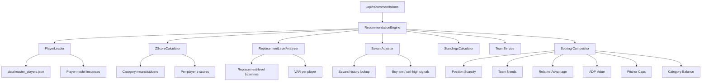

# Design Document: Recommendation Engine Rebuild

## Overview

This design replaces the current 983-line `RecommendationEngine` with a modular, z-score-driven architecture. The current engine suffers from:

- Dead ML scaffolding (`MLTrainer` imports, `_ml_models_loaded` flag, `use_ml` parameter)
- Broken CSV-based data loading pipeline
- Arbitrary stat multipliers in `_analyze_projected_value` instead of statistically grounded valuation
- No replacement-level analysis — all players valued in a vacuum
- No Statcast integration despite rich Savant data available in `master_players.json`

The rebuild introduces four new service components (`PlayerLoader`, `ZScoreCalculator`, `ReplacementLevelAnalyzer`, `SavantAdjuster`) and refactors the existing `RecommendationEngine` into a clean compositor that delegates to these services. The existing `StandingsCalculator`, `DraftService`, and `TeamService` remain unchanged.

### Key Design Decisions

1. **Separate services over monolith**: Each analytical concern (z-scores, replacement level, Savant) gets its own module rather than being inlined into a single 1000+ line class. This makes each piece independently testable.
2. **Z-scores over arbitrary multipliers**: The current engine uses hardcoded multipliers (e.g., `value_score / 10 * 0.2`). Z-scores normalize all categories to the same scale automatically.
3. **Replacement level over raw value**: A player's fantasy value depends on what's available at their position. A 25-HR catcher is far more valuable than a 25-HR outfielder.
4. **Savant as adjustment, not replacement**: Projections remain the primary valuation source. Savant data adjusts confidence up or down, flagging buy-low/sell-high candidates.
5. **Configurable weights**: The compositor uses a weights dict so component balance can be tuned without code changes.

## Architecture



### Data Flow

1. **Startup**: `PlayerLoader` reads `master_players.json`, creates `Player` instances with blended projections and ADP, stores Savant history in a side dict keyed by `player_id`.
2. **Draft begins**: `ZScoreCalculator` computes means/stddevs across the full undrafted pool. `ReplacementLevelAnalyzer` computes initial replacement levels per position.
3. **Each recommendation request**: The engine iterates candidate players, computing a composite score from 9 factors. Z-scores and replacement levels are recalculated against the current undrafted pool. Results are sorted and the top 10–30 returned.
4. **After each pick**: The undrafted pool shrinks, triggering recalculation of z-score baselines and replacement levels on the next recommendation request.

### Module Layout

```
src/
  services/
    player_loader.py          # NEW — reads master_players.json, hydrates Player instances
    zscore_calculator.py      # NEW — z-score computation per category
    replacement_level.py      # NEW — replacement-level and VAR analysis
    savant_adjuster.py        # NEW — Statcast-based projection adjustments
    recommendation_engine.py  # REFACTORED — slim compositor, delegates to above
    standings_calculator.py   # UNCHANGED
    draft_service.py          # UNCHANGED
    team_service.py           # UNCHANGED
  models/
    player.py                 # UNCHANGED (blended keys already match field names)
  api/
    app.py                    # MINOR CHANGES — swap init to use PlayerLoader
```

## Components and Interfaces

### PlayerLoader (`src/services/player_loader.py`)

Reads `data/master_players.json` and produces `Player` instances plus a Savant history lookup.

```python
class PlayerLoader:
    POSITION_MAP = {
        "RF": "OF", "LF": "OF", "CF": "OF",
        "DH": "U",
        # SP, RP, C, 1B, 2B, 3B, SS pass through unchanged
    }

    def load(self, filepath: str = "data/master_players.json") -> Tuple[List[Player], Dict[str, dict]]:
        """
        Returns:
            players: List of Player instances with blended projections and ADP
            savant_data: Dict keyed by player_id -> most recent savant season dict
        """

    def _create_player(self, key: str, entry: dict) -> Player:
        """Map a single JSON entry to a Player dataclass."""

    def _map_position(self, raw_position: str) -> str:
        """Map raw position (RF, LF, CF, DH) to draft position (OF, U, etc.)."""

    def _resolve_adp(self, entry: dict) -> Optional[float]:
        """Return nfbc_adp if present, else cbs_adp, else None."""

    def _extract_savant(self, entry: dict) -> Optional[dict]:
        """Return the most recent season's Savant data dict, or None."""
```

### ZScoreCalculator (`src/services/zscore_calculator.py`)

Computes per-category z-scores for all players relative to their position type (hitter/pitcher).

```python
class ZScoreCalculator:
    BATTING_CATEGORIES = ['HR', 'OBP', 'R', 'RBI', 'SB']
    PITCHING_CATEGORIES = ['ERA', 'K', 'SHOLDS', 'WHIP', 'WQS']
    INVERTED_CATEGORIES = {'ERA', 'WHIP'}  # lower is better

    def calculate(self, players: List[Player]) -> Dict[str, Dict[str, float]]:
        """
        Returns dict keyed by player_id -> {category: z_score, ..., 'composite': float}
        """

    def _compute_stats(self, players: List[Player], categories: List[str],
                       extractor: Callable) -> Dict[str, Tuple[float, float]]:
        """Compute mean and stddev for each category. Returns {cat: (mean, std)}."""

    def _player_category_value(self, player: Player, category: str) -> Optional[float]:
        """Extract a player's raw value for a category, computing SHOLDS/WQS as needed."""

    def _zscore(self, value: float, mean: float, std: float, inverted: bool) -> float:
        """Compute z-score. Inverts sign for ERA/WHIP. Returns 0.0 if std == 0."""
```

### ReplacementLevelAnalyzer (`src/services/replacement_level.py`)

Determines replacement-level baselines and computes Value Above Replacement.

```python
class ReplacementLevelAnalyzer:
    # Number of roster slots per position across 13 teams
    POSITION_SLOTS = {
        'C': 13, '1B': 13, '2B': 13, '3B': 13, 'SS': 13,
        'MI': 13, 'CI': 13, 'OF': 52, 'U': 13, 'P': 117,
    }
    FLEX_ELIGIBLE = {
        'MI': {'2B', 'SS'},
        'CI': {'1B', '3B'},
        'U': {'C', '1B', '2B', '3B', 'SS', 'OF'},  # any hitter
    }

    def analyze(self, players: List[Player],
                zscores: Dict[str, Dict[str, float]]) -> Dict[str, float]:
        """
        Returns dict keyed by player_id -> VAR (value above replacement).
        Each player's VAR uses the position where they provide the highest VAR.
        """

    def _replacement_level(self, position: str, eligible_players: List[Player],
                           zscores: Dict[str, Dict[str, float]]) -> float:
        """
        Find the composite z-score of the replacement-level player at a position.
        Replacement level = the player at rank equal to POSITION_SLOTS[position].
        """

    def _eligible_for_position(self, player: Player, position: str) -> bool:
        """Check if a player can fill a given position slot."""
```

### SavantAdjuster (`src/services/savant_adjuster.py`)

Uses Statcast metrics to adjust player scores up or down.

```python
class SavantAdjuster:
    # League-average baselines (approximate MLB averages)
    AVG_BARREL_RATE = 8.0
    AVG_EXIT_VELO = 88.5
    AVG_SPRINT_SPEED = 27.0  # ft/s
    AVG_XWOBA = 0.315

    def adjust(self, player: Player, savant: Optional[dict]) -> Tuple[float, Optional[str]]:
        """
        Returns (adjustment_score, signal_string_or_none).
        signal_string is e.g. "Buy-low: xwOBA .350 vs actual .310" or None if no signal.
        """

    def _hitter_adjustment(self, player: Player, savant: dict) -> Tuple[float, Optional[str]]:
        """Compute adjustment for a hitter based on xwOBA gap, barrel rate, exit velo, sprint speed."""

    def _pitcher_adjustment(self, player: Player, savant: dict) -> Tuple[float, Optional[str]]:
        """Compute adjustment for a pitcher based on xwOBA-against and expected ERA indicators."""
```

### RecommendationEngine (refactored, `src/services/recommendation_engine.py`)

Slim compositor that delegates to the above services and combines 9 scoring factors.

```python
class RecommendationEngine:
    DEFAULT_WEIGHTS = {
        'zscore': 1.0,
        'var': 1.0,
        'savant': 0.5,
        'position_scarcity': 0.8,
        'team_needs': 1.0,
        'relative_advantage': 0.7,
        'adp_value': 0.9,
        'pitcher_caps': 1.0,
        'category_balance': 0.6,
    }

    def __init__(self, draft_service: DraftService, players: List[Player],
                 savant_data: Dict[str, dict], weights: Dict[str, float] = None):
        self.draft_service = draft_service
        self.standings_calculator = StandingsCalculator()
        self.team_service = TeamService()
        self.all_players = players
        self.savant_data = savant_data
        self.zscore_calc = ZScoreCalculator()
        self.replacement_analyzer = ReplacementLevelAnalyzer()
        self.savant_adjuster = SavantAdjuster()
        self.weights = weights or self.DEFAULT_WEIGHTS

    def get_recommendations(self, available_players, my_team, draft_state,
                            top_n=10) -> List[Dict]:
        """Return top_n recommendations sorted by composite score."""

    def _score_player(self, player, my_team, available_players, draft_state,
                      all_team_rosters, zscores, var_scores, team_name) -> Tuple[float, str]:
        """Compute composite score from 9 factors. Returns (score, reasoning_string)."""

    def _score_position_scarcity(self, player, available_players, draft_state,
                                 all_team_rosters) -> Tuple[float, str]:
        """Existing logic, cleaned up."""

    def _score_team_needs(self, player, my_team, draft_state,
                          available_players) -> Tuple[float, str]:
        """Existing logic, cleaned up."""

    def _score_relative_advantage(self, player, my_team, all_team_rosters,
                                  draft_state, team_name) -> Tuple[float, str]:
        """Existing logic, cleaned up."""

    def _score_adp_value(self, player, draft_state) -> Tuple[float, str]:
        """ADP value with tiered reach penalties."""

    def _score_pitcher_caps(self, player, my_team, draft_state) -> Tuple[float, str]:
        """Pitcher roster limits and closer needs."""

    def _score_category_balance(self, player, my_team, all_team_rosters,
                                team_name) -> Tuple[float, str]:
        """Category balance bonus for weak categories."""
```

### API Integration (`src/api/app.py` changes)

Minimal changes to `app.py`:

```python
# At startup, replace:
#   all_players = load_players_from_csv(...)
#   recommendation_engine = RecommendationEngine(draft_service, all_players)
# With:
from src.services.player_loader import PlayerLoader

loader = PlayerLoader()
all_players, savant_data = loader.load()
recommendation_engine = RecommendationEngine(draft_service, all_players, savant_data)

# In get_recommendations(), remove use_ml parameter:
recommendations = recommendation_engine.get_recommendations(
    available_players=available,
    my_team=my_team,
    draft_state=draft_service.current_draft,
    top_n=10
)
```

The response shape stays identical: `{'recommendations': [{'player': {...}, 'score': float, 'reasoning': str}]}`.


## Data Models

### Player Model (unchanged)

The existing `Player` dataclass in `src/models/player.py` already has fields that match the `blended` keys in `master_players.json` exactly:

| Player field | Blended key | Category |
|---|---|---|
| `projected_home_runs` | `projected_home_runs` | HR |
| `projected_obp` | `projected_obp` | OBP |
| `projected_runs` | `projected_runs` | R |
| `projected_rbi` | `projected_rbi` | RBI |
| `projected_stolen_bases` | `projected_stolen_bases` | SB |
| `projected_wins` | `projected_wins` | W (part of WQS) |
| `projected_quality_starts` | `projected_quality_starts` | QS (part of WQS) |
| `projected_strikeouts` | `projected_strikeouts` | K |
| `projected_era` | `projected_era` | ERA |
| `projected_whip` | `projected_whip` | WHIP |
| `projected_saves` | `projected_saves` | SV (part of SHOLDS) |
| `projected_holds` | `projected_holds` | HD (part of SHOLDS) |
| `projected_innings_pitched` | `projected_innings_pitched` | IP |
| `adp` | resolved from `nfbc_adp` / `cbs_adp` | ADP |

No changes to the Player model are required. The `PlayerLoader` maps blended values directly to these fields.

### Savant Data Structure

Savant data is stored in a flat dict keyed by `player_id`, containing the most recent season's stats:

```python
savant_data: Dict[str, dict] = {
    "aaron_judge": {
        "pa": 633.0, "ab": 550.0, "h": 158.0, "hr": 39.0,
        "avg": 0.287, "obp": 0.373, "slg": 0.544,
        "xba": 0.302, "xobp": 0.388, "xslg": 0.601, "xwoba": 0.418,
        "exit_velo": 95.8, "barrel_rate": 17.6, "hard_hit_pct": 58.4,
        "sprint_speed": 107.09,
        # ... other fields preserved but not used by SavantAdjuster
    },
    "tarik_skubal": {
        "g": 31.0, "ip": 195.2, "w": 18.0, "era": 2.21,
        "xba": 0.206, "xobp": 0.246, "xwoba": 0.258,
        "exit_velo": 86.1, "barrel_rate": 8.1, "whiff_pct": 32.5,
        # ... pitcher-specific Savant fields
    },
}
```

The `SavantAdjuster` reads `xwoba`, `barrel_rate`, `exit_velo`, `sprint_speed` for hitters and `xwoba`, `exit_velo`, `barrel_rate`, `whiff_pct` for pitchers. All other fields are preserved but not consumed.

### Z-Score Output Structure

```python
zscores: Dict[str, Dict[str, float]] = {
    "aaron_judge": {
        "HR": 2.15, "OBP": 1.89, "R": 1.42, "RBI": 1.67, "SB": -0.31,
        "composite": 6.82
    },
    "tarik_skubal": {
        "ERA": 1.95, "K": 2.10, "SHOLDS": -0.85, "WHIP": 1.78, "WQS": 2.30,
        "composite": 7.28
    },
}
```

Hitters get 5 batting z-scores + composite. Pitchers get 5 pitching z-scores + composite. SHOLDS is computed as `projected_saves + (projected_holds * 0.5)`. WQS is computed as `projected_wins + projected_quality_starts`.

### Composite Score Breakdown

Each player's final score is a weighted sum:

```
final_score = (
    weights['zscore']            * composite_zscore +
    weights['var']               * value_above_replacement +
    weights['savant']            * savant_adjustment +
    weights['position_scarcity'] * scarcity_score +
    weights['team_needs']        * needs_score +
    weights['relative_advantage']* relative_score +
    weights['adp_value']         * adp_score +
    weights['pitcher_caps']      * pitcher_cap_score +
    weights['category_balance']  * balance_score
)
```

### Reasoning String Format

Each recommendation includes a human-readable reasoning string:

```
"Z: 6.82 | VAR: 4.15 (OF) | Savant: +0.8 (Buy-low: xwOBA .418 vs .373) | Scarcity: +2.1 (OF thin) | Needs: +3.0 (OF slot open) | Advantage: +1.5 (boosts HR, R) | ADP: +2.3 (falling 12 picks) | Balance: +1.0 (improves HR rank 11→8)"
```


## Correctness Properties

*A property is a characteristic or behavior that should hold true across all valid executions of a system — essentially, a formal statement about what the system should do. Properties serve as the bridge between human-readable specifications and machine-verifiable correctness guarantees.*

### Property 1: Player loading round-trip

*For any* valid player entry in master_players.json with a `blended` key, loading it through `PlayerLoader` should produce a `Player` instance whose projection fields exactly match the values in the `blended` dict.

**Validates: Requirements 1.1**

### Property 2: ADP resolution priority

*For any* player entry, the resolved ADP should equal `nfbc_adp` when it is present and non-null, else `cbs_adp` when present and non-null, else `None`.

**Validates: Requirements 1.2, 1.3**

### Property 3: Savant data keyed by player ID

*For any* player entry that contains savant history data, after loading, the `savant_data` dict should contain that player's `player_id` as a key mapping to the most recent season's stats.

**Validates: Requirements 1.5, 5.8**

### Property 4: Position mapping preserves valid draft positions

*For any* raw position string from master_players.json, the mapped position should be one of the valid draft positions (`C`, `1B`, `2B`, `3B`, `SS`, `OF`, `SP`, `RP`, `P`, `U`), and outfield variants (`RF`, `LF`, `CF`) should all map to `OF`.

**Validates: Requirements 1.6**

### Property 5: Z-score formula correctness

*For any* set of players with blended projections and any scoring category, each player's z-score should equal `(player_value - mean) / std` where mean and std are computed across all players of the same type (hitter/pitcher), and the composite z-score should equal the sum of individual category z-scores.

**Validates: Requirements 3.1, 3.3, 3.4**

### Property 6: Inverted z-scores for rate categories

*For any* two pitchers A and B where pitcher A has a lower ERA (or WHIP) than pitcher B, pitcher A's z-score for that category should be higher (more positive) than pitcher B's.

**Validates: Requirements 3.2**

### Property 7: Derived category formulas (SHOLDS and WQS)

*For any* pitcher with projected saves, holds, wins, and quality starts, the SHOLDS value used for z-score computation should equal `projected_saves + (projected_holds × 0.5)`, and the WQS value should equal `projected_wins + projected_quality_starts`.

**Validates: Requirements 3.6, 3.7**

### Property 8: Value Above Replacement computation

*For any* player and position, the player's VAR should equal their composite z-score minus the composite z-score of the replacement-level player (the player ranked at the position's total roster slot count among undrafted players), and multi-position players should use the position yielding the highest VAR.

**Validates: Requirements 4.1, 4.2, 4.3**

### Property 9: Replacement level recalculation after drafting

*For any* draft state, the replacement-level z-score at a position computed from the current undrafted pool should differ from the replacement level computed from the full pool whenever drafted players were above replacement level at that position.

**Validates: Requirements 4.4**

### Property 10: Flex position replacement level uses combined pool

*For any* flex position (MI, CI, U), the replacement-level player should be drawn from the combined pool of all eligible primary positions (MI from 2B+SS, CI from 1B+3B, U from all hitters).

**Validates: Requirements 4.5**

### Property 11: Savant xwOBA adjustment direction

*For any* hitter with Savant data where xwOBA and actual OBP are both available, the sign of the Savant adjustment should match the sign of `(xwOBA - actual_obp)` when the gap exceeds the meaningful margin threshold, and should be zero when the gap is below the threshold.

**Validates: Requirements 5.1, 5.2, 5.3**

### Property 12: Above-average Savant metrics produce non-negative power/speed adjustments

*For any* hitter with barrel rate above league average and exit velocity above league average, the power-related Savant adjustment component should be non-negative. *For any* hitter with sprint speed above league average, the speed-related adjustment component should be non-negative.

**Validates: Requirements 5.4, 5.5**

### Property 13: Pitcher Savant adjustment direction

*For any* pitcher with Savant data, the adjustment direction should reflect whether expected stats (xwOBA-against) suggest the pitcher's actual ERA/WHIP is sustainable — a lower xwOBA-against than actual performance implies a positive adjustment.

**Validates: Requirements 5.6**

### Property 14: Position scarcity monotonicity

*For any* position, as the ratio of above-average remaining players to teams needing that position decreases, the scarcity score for players at that position should increase (or stay the same). Flex positions should use the combined eligible player pool.

**Validates: Requirements 6.1, 6.2, 6.3, 6.5**

### Property 15: Unfilled position needs bonus

*For any* team with an unfilled required roster position and a player eligible for that position, the team needs score should be positive.

**Validates: Requirements 7.2**

### Property 16: Filled position negative adjustment

*For any* team that has reached the maximum player count at a position, the team needs score for an additional player at that position should be negative.

**Validates: Requirements 7.3**

### Property 17: Flex position eligibility in needs scoring

*For any* team with an unfilled MI slot and a player whose primary position is 2B or SS, the needs scoring should recognize that player as filling the MI need (and similarly for CI with 1B/3B, and U with any hitter).

**Validates: Requirements 7.4**

### Property 18: Pitcher baseline needs

*For any* team with fewer than 9 pitchers, the team needs score for any pitcher should be non-negative.

**Validates: Requirements 7.5**

### Property 19: Relative advantage scales with category ranking

*For any* team and scoring category, the bonus applied for a player improving that category should be larger when the team ranks in the bottom third (9th–13th) than when the team ranks in the top third (1st–4th).

**Validates: Requirements 8.2, 8.3**

### Property 20: ADP value monotonicity

*For any* player with ADP data, the ADP value score should be positive when ADP > current_pick (value pick), negative when ADP < current_pick (reach), and the magnitude should increase with the size of the gap. Larger reaches should be penalized more than smaller reaches (tiered penalties).

**Validates: Requirements 9.1, 9.2, 9.4**

### Property 21: Pitcher cap penalty increases with pitcher count

*For any* team, the pitcher cap penalty for adding another pitcher should be more negative when the team has 9+ pitchers than when the team has 7–8 pitchers, and zero or positive when the team has fewer than 7 pitchers.

**Validates: Requirements 10.1, 10.2**

### Property 22: Closer bonus decreases with closer count

*For any* closer-eligible player (projected_saves >= 10), the closer bonus should be largest when the team has 0 closers (after pick 80), smaller with 1 closer (after pick 130), and smallest with 2 closers (after pick 180).

**Validates: Requirements 10.3, 10.4, 10.5**

### Property 23: Category balance activates at 5+ players

*For any* team with fewer than 5 drafted players, the category balance score should be zero. *For any* team with 5+ players losing to 8+ opponents in a category, a player improving that category should receive a positive balance bonus.

**Validates: Requirements 11.1, 11.2**

### Property 24: Composite score is weighted sum of components

*For any* player and scoring context, the final composite score should equal the weighted sum of the 9 individual component scores (z-score, VAR, Savant, scarcity, needs, relative advantage, ADP, pitcher caps, category balance) using the configured weights.

**Validates: Requirements 12.1, 12.2**

### Property 25: Recommendations sorted by descending score

*For any* list of recommendations returned by the engine, each recommendation's score should be greater than or equal to the next recommendation's score.

**Validates: Requirements 12.4**

### Property 26: Recommendation count bounds

*For any* recommendation request with at least 10 available players, the engine should return between 10 and 30 recommendations (inclusive).

**Validates: Requirements 12.5**

### Property 27: Savant signals appear in reasoning

*For any* player whose Savant adjustment produces a buy-low or sell-high signal, the reasoning string in the recommendation should contain that signal text.

**Validates: Requirements 12.3, 13.4**


## Error Handling

### PlayerLoader Errors

| Scenario | Handling |
|---|---|
| `master_players.json` not found | Raise `FileNotFoundError` with descriptive message. App startup fails fast. |
| JSON parse error | Raise `ValueError` wrapping the JSON decode error. |
| Player entry missing `name` or `player_id` | Skip entry, log warning. Continue loading remaining players. |
| Player entry missing `blended` key | Create Player with `None` projection fields. Log info. |
| Player entry missing `savant_history` | No savant entry stored. `SavantAdjuster` handles `None` gracefully. |
| Unknown position string | Pass through unmapped. Log warning. |

### ZScoreCalculator Errors

| Scenario | Handling |
|---|---|
| Empty player pool | Return empty dict. No z-scores to compute. |
| All players have `None` for a category | Skip that category (treat as std=0, z-score=0.0 for all). |
| Standard deviation is zero | Assign z-score of 0.0 for that category (per Requirement 3.5). |
| Player missing projection for a category | Exclude from mean/std calculation. Assign z-score of 0.0 for that player in that category. |

### ReplacementLevelAnalyzer Errors

| Scenario | Handling |
|---|---|
| Fewer players at a position than roster slots | Replacement level defaults to the worst player's composite z-score at that position. |
| No players at a position | Replacement level is 0.0. All players at that position get their raw composite as VAR. |
| Player eligible for zero positions | VAR is 0.0. Should not happen with valid data. |

### SavantAdjuster Errors

| Scenario | Handling |
|---|---|
| `savant_data` is `None` for a player | Return `(0.0, None)` — no adjustment, no signal. |
| Savant data missing `xwoba` | Return `(0.0, None)` — cannot compute xwOBA gap. |
| Savant data missing `barrel_rate` or `exit_velo` | Skip power adjustment component. Other components still apply. |
| Savant data missing `sprint_speed` | Skip speed adjustment component. |

### RecommendationEngine Errors

| Scenario | Handling |
|---|---|
| No active draft | Return HTTP 400 with `{'success': False, 'message': 'No active draft'}` (existing behavior). |
| Fewer than 10 available players | Return all available players (relax minimum bound). |
| Scoring exception for a single player | Log error, skip that player, continue with remaining candidates. |
| StandingsCalculator returns empty data | Category balance and relative advantage scores default to 0.0. |

## Testing Strategy

### Property-Based Testing

Use **Hypothesis** (Python property-based testing library) for all correctness properties.

Each property test must:
- Run a minimum of 100 iterations (`@settings(max_examples=100)`)
- Reference its design property in a comment tag
- Use Hypothesis strategies to generate random player pools, draft states, and savant data

Tag format: `# Feature: recommendation-engine-rebuild, Property {N}: {title}`

Each correctness property (Properties 1–27) maps to exactly one Hypothesis test function.

**Key generators needed:**
- `player_strategy()`: Generates random `Player` instances with valid projection ranges
- `player_pool_strategy()`: Generates lists of 50–200 players with realistic position distributions
- `savant_strategy()`: Generates random Savant stat dicts with realistic ranges
- `draft_state_strategy()`: Generates `DraftState` with 0–200 picks made
- `weights_strategy()`: Generates random weight dicts with values 0.0–2.0

### Unit Tests

Unit tests complement property tests for specific examples and edge cases:

- **PlayerLoader**: Load the actual `master_players.json` and verify known players (Aaron Judge, Tarik Skubal) have correct field values. Test entries with missing blended data.
- **ZScoreCalculator**: Hand-computed z-score examples with 3–4 players. Verify zero-std edge case. Verify SHOLDS/WQS formulas with known values.
- **ReplacementLevelAnalyzer**: Small pool (5 players, 2 positions) with hand-computed replacement levels and VAR.
- **SavantAdjuster**: Known buy-low candidate (high xwOBA, low actual). Known sell-high candidate. Player with no savant data.
- **RecommendationEngine**: Integration test with a small draft scenario (5 teams, 10 players) verifying the composite score matches manual calculation.
- **API endpoint**: Verify `/api/recommendations` returns the expected JSON shape with `player`, `score`, and `reasoning` fields.

### Test File Layout

```
tests/
  test_player_loader.py           # Unit + property tests for PlayerLoader
  test_zscore_calculator.py       # Unit + property tests for ZScoreCalculator
  test_replacement_level.py       # Unit + property tests for ReplacementLevelAnalyzer
  test_savant_adjuster.py         # Unit + property tests for SavantAdjuster
  test_recommendation_engine.py   # Unit + property tests for the compositor
  conftest.py                     # Shared fixtures and Hypothesis strategies
```
